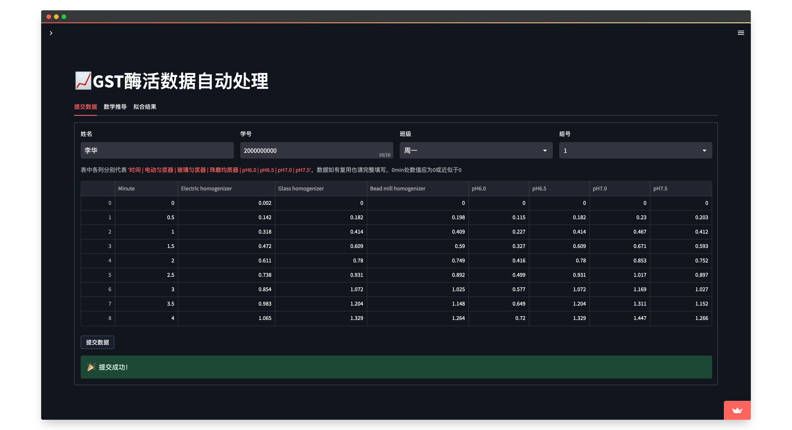
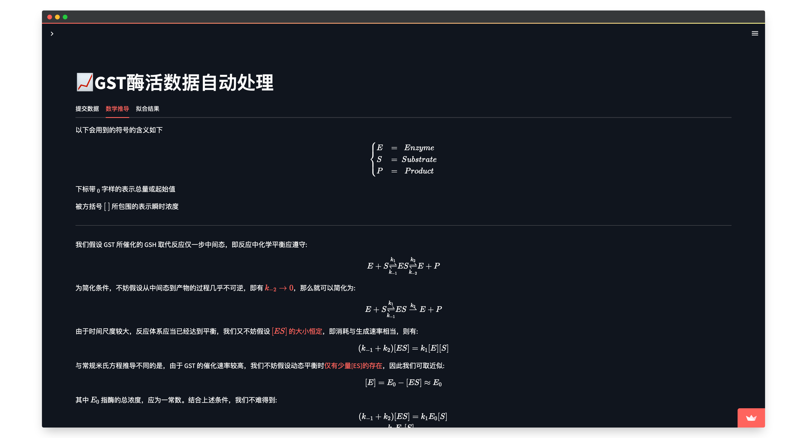
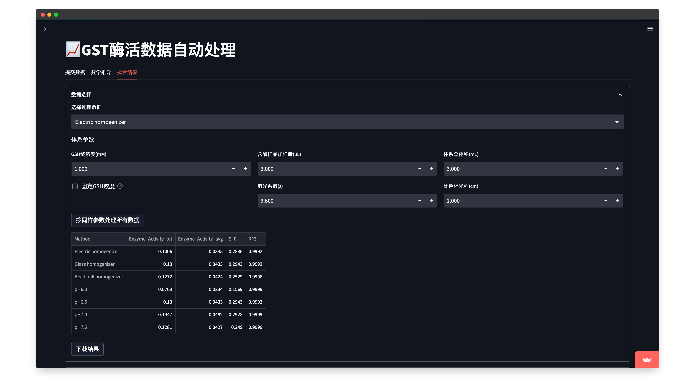
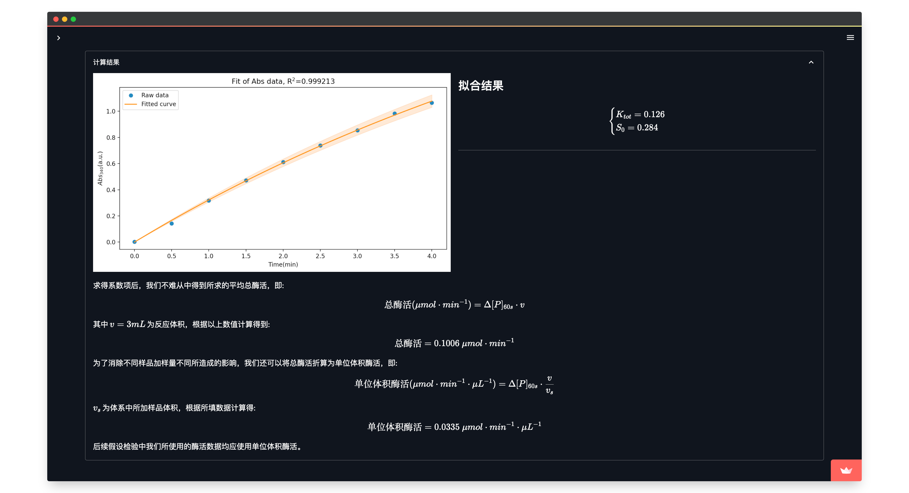
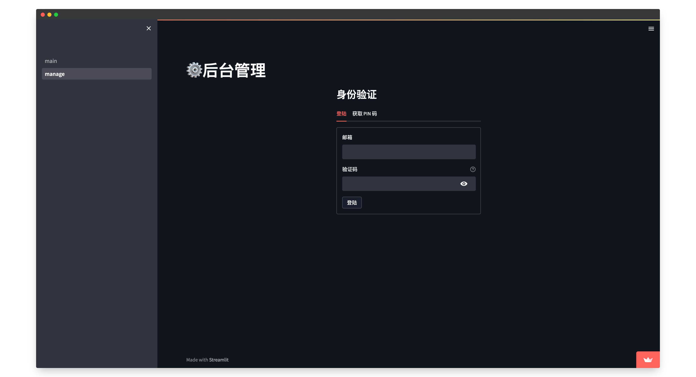
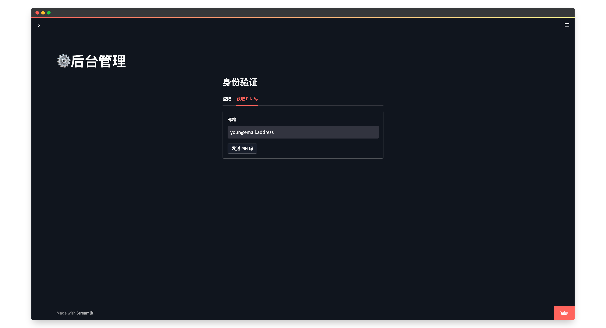
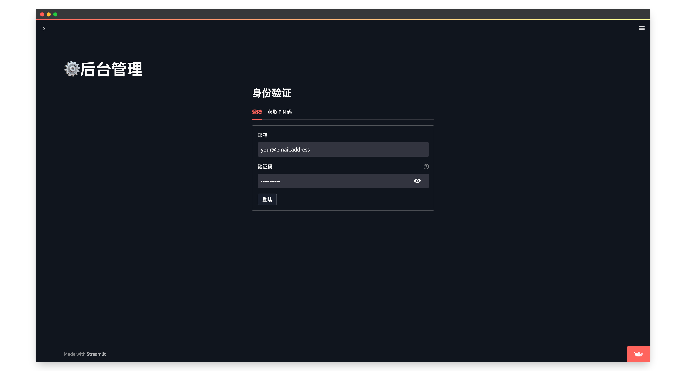
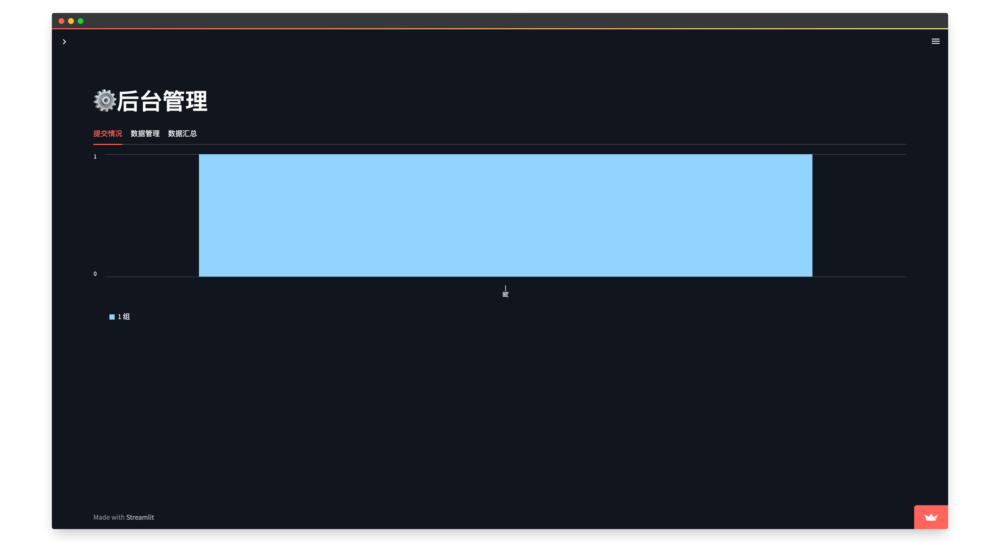
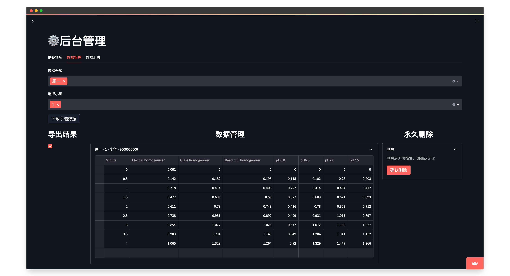
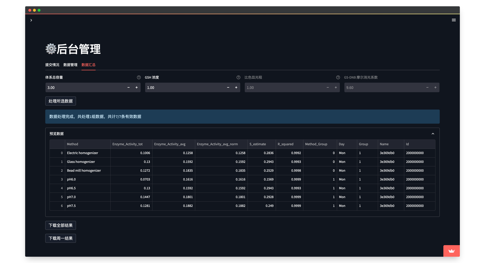

# GST open data collect [](https://gst-data-collect.streamlit.app/)

一个简单公开的，用于教学目的的，收集 GST 实验数据的应用：[README](./README_en.md) | [中文说明](./README.md)

## 用法

### 学生

1. 前往网页应用界面： [https://gst-data-collect.streamlit.app/](https://gst-data-collect.streamlit.app/)
2. 填写表格信息（姓名、学号等）以及实验数据，之后点击提交。如果提交无误，你将会看到一个成功消息。 
3. 前往数学推导页面，该页包含了对于处理数据所用模型的推导与证明。 
4. 前往拟合结果页面，可以在此设置模型参数并且处理所有数据条目。 
5. 本页面中还有拟合结果的图像以及公式。至此就完成了提交了！ 

### 教师

1. 在侧边栏中，切换到“manage”页面（或者直接访问 [https://gst-data-collect.streamlit.app/manage](https://gst-data-collect.streamlit.app/manage)） 
2. 如果你是第一次使用此应用，你需要首先获取你的 PIN 码。填写你的邮箱地址然后提交，当一份包含 PIN 码的邮件发送成功后你将能看到成功信息。**注意**：PIN 码将在每月月初更新，因此你可能需要重新获取 PIN 码。 
3. 用你的 PIN 码登陆管理页面。只要你保持该浏览器标签不关闭，你就不需要重新登录。 
4. 你可以查看提交情况的统计 
5. 你也可以以 `zip` 压缩包格式下载所有原始数据。你也可以设置过滤规则来选取一部分的数据（上方的多选和每行的复选框），你还可以在线修改数据（不推荐，存在部分 BUG），甚至如果你愿意的话，可以永久删除数据。 
6. 最后，你可以汇总所有数据，并且以 `csv` 格式下载结果。可以选择下载所有班级的结果，也可以下载特定日期/班级的结果，这在分发数据给同学时将很有帮助。 

## 部署

本应用已经部署至 [streamlit 云](https://streamlit.io/cloud)，并且也推荐通过此方式来使用本项目。当然，如果你需要或者想要将其部署至本地或你的服务器，则可以参考以下的指导流程。

### 安装依赖

安装本项目的所有依赖项，你只需要运行以下命令：

```bash
$ pip3 install -r requirements.txt
```

### 注意事项

出于数据安全的考虑，密码等敏感信息不会被存储在仓库中。你需要在项目的 `.streamlit` 目录下创建一个名为 `secrets.toml` 的文件，并且添加以下内容：

```toml
[admin]
require_auth = true
address = [
    "admin@email.address",
]
salt = [
    'onesalt',
    'twosalt',
    '...',
]

[email]
account = "your.email.address@gmail.com"
passwd = "your.email.password"
```

以上秘密仅会被用于身份验证和邮件发送。管理员的邮箱地址不受限制，而加密用的“盐值”则可以根据你的需求进行修改。配置中的唯一限制是你需要使用一个 Gmail 账户来发送邮件。

如果你想要禁用此功能，你可以将 `require_auth` 选项设置为 `false`，那么其余的配置将会被忽略。这种情况下，所有人都将能访问管理页面。

### 运行应用

启动应用非常简单，如果你不需要任何修改的话。只需要运行以下命令：

```bash
$ streamlit run main.py
```

你也可以通过运行时添加额外选项，或者写入配置文件，甚至是使用环境变量来设置各种配置。更多信息请参考 [streamlit 文档](https://docs.streamlit.io/en/stable/cli.html)。

### 访问应用

默认情况下，应用将会被绑定至 `localhost:8501`。你可以通过在命令中添加 `--server.port` 选项来修改端口号。例如，如果你想要将应用部署在 `localhost:8080` 上，你可以运行以下命令：

```bash
$ streamlit run main.py --server.port 8080
```

## 许可

本项目使用 [MIT 许可](./LICENSE)。

## 贡献

如果你发现了任何 BUG 或者有任何建议，欢迎随时提交 issue 或 pull request。
