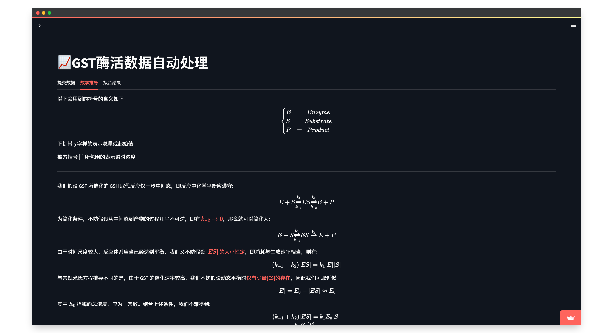
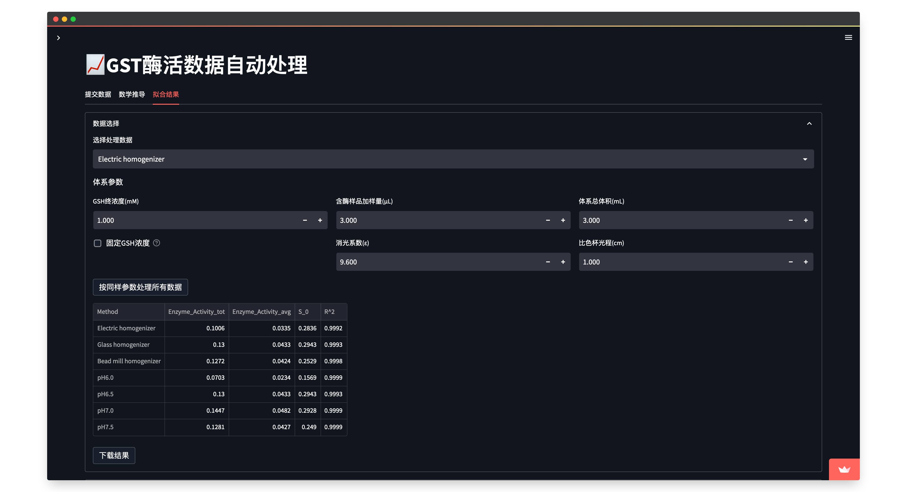
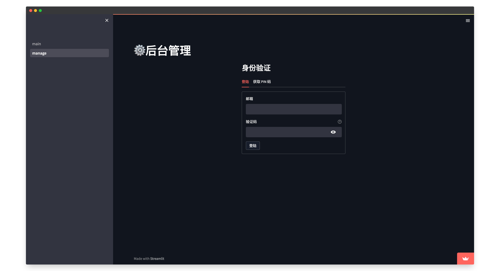
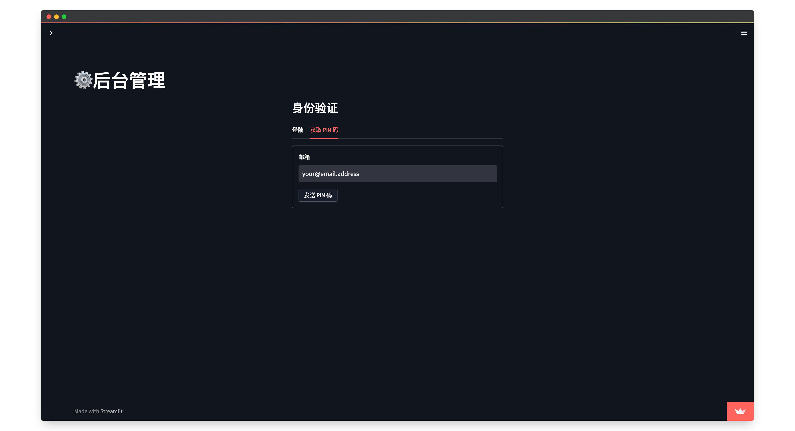
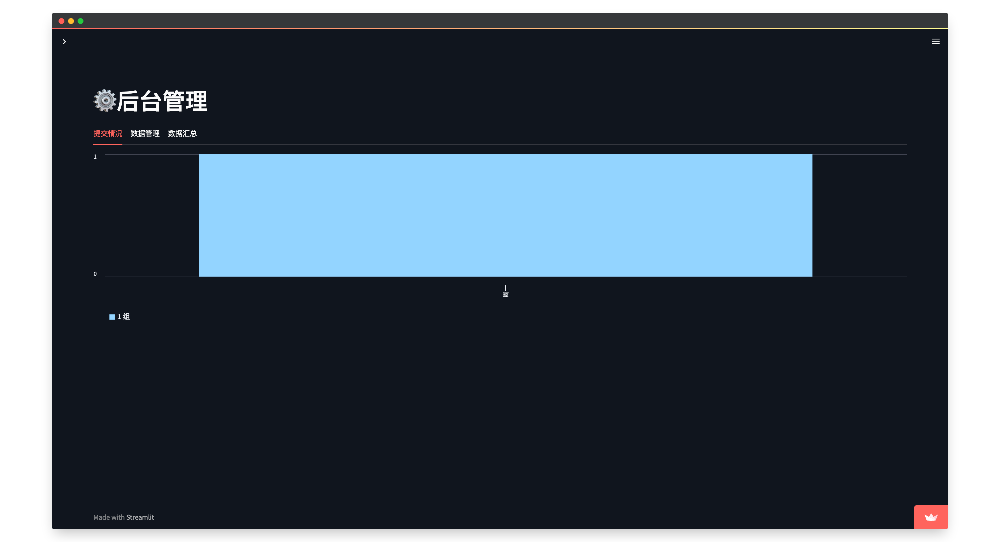

# GST open data collect [](https://gst-data-collect.streamlit.app/)

A simple public app for collecting GST experiment data for teaching purpose: [README](./README_en.md) | [中文说明](./README.md)

## Usage

### Student

1. Go to the web application page [https://gst-data-collect.streamlit.app/](https://gst-data-collect.streamlit.app/)
2. Fill in the form with correct information (name, student ID, etc.) and the experiment data. Then click submit, and you should see a success message if the data is successfully submitted. 
3. Check out the model proof page to see the proof of the method we use to process the data you've just submitted. 
4. Go to the result page to set some parameters and output the result. 
5. Check out the fitting result of your data. You are all set! 

### Teacher

1. Switch to the admin page by selecting "manage" in the sidebar (or by directly going to [https://gst-data-collect.streamlit.app/manage](https://gst-data-collect.streamlit.app/manage)). 
2. If you are the first time to use this app, you need to get your PIN code. Fill in the form requesting your email address, and then click submit. You should see a success message if an email containing the PIN code is successfully sent to you. Note that the PIN code is refreshed per month, so you need to get a new one every month. 
3. Login in the admin page with your PIN code. You should only need to do this once as long as you keep your browser tab alive. 
4. You can see the statistics of collected data. 
5. All raw data can be downloaded in `zip` format. You can set and apply filters to only select a subset of the data (multi-select on the top & checkbox per row), and you can modify the data online (although this is not recommended due to bugs in the experimental data editor API), or even delete them if you decide to do so. 
6. Finally, you can summarize all data and download the summary in `csv` format. You can also choose to download the summary for a specific date (i.e. class number). This is useful for distributing the data to students. 

## Deployment

This app is already deployed on [streamlit cloud](https://streamlit.io/cloud), and it is recommended to use this project this way. However, if you still need or want to have it deployed locally or on your own server, you can do it by following the instructions below.

### Prerequisites

Install all the dependencies for this project by running the following command:

```bash
$ pip3 install -r requirements.txt
```

### Before you start

For the sake of data security, secrets are not stored in the repository. You need to create a file named `secrets.toml` in the `.streamlit` directory of this project, and add the following lines to it:

```toml
[admin]
require_auth = true
address = [
    "admin@email.address",
]
salt = [
    'onesalt',
    'twosalt',
    '...',
]

[email]
account = "your.email.address@gmail.com"
passwd = "your.email.password"
```

These secrets are only used for authentication and email sending. Email address of admins are not limited, and the salt for encryption is recommended to be modified to suite your needs. The only limitation of the configuration is that you will need to use a Gmail account to send emails.

If you do not want to use this feature, you can change the `require_auth` option to `false` and the rest of the config will be ignored. In this case, the access to the management page will be open to everyone.

### Run the app

It is rather easy to start the app if you do not require any modifications. Simply run the following command:

```bash
$ streamlit run main.py
```

You can also set a variety of configurations either at runtime by appending options or by writing to configuration files and even by using environment variables. For more information, please refer to the [streamlit documentation](https://docs.streamlit.io/en/stable/cli.html).

### Access the app

The app will be hosted on `localhost:8501` by default. You can change the port number by appending the `--server.port` option to the command above. For example, if you want to host the app on `localhost:8080`, you can run the following command:

```bash
$ streamlit run main.py --server.port 8080
```

## License

This project is licensed under the terms of the [MIT license](./LICENSE).

## Contributing

If you find any bugs or have any suggestions, please feel free to open an issue or submit a pull request.
